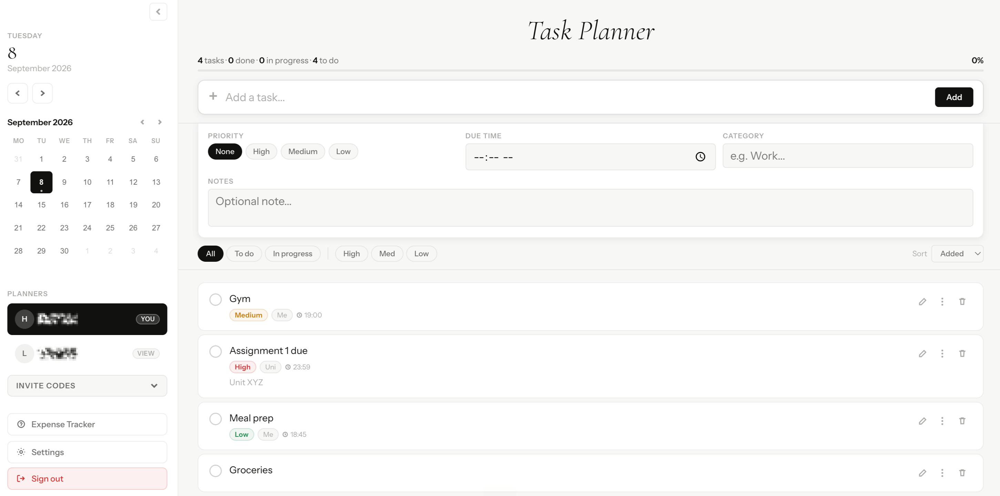
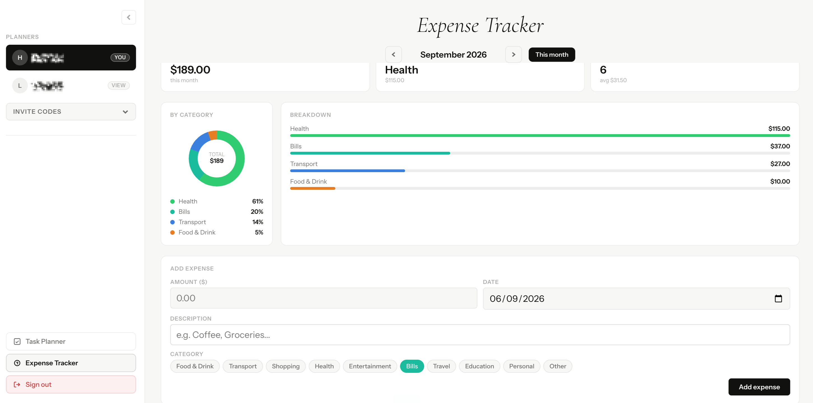
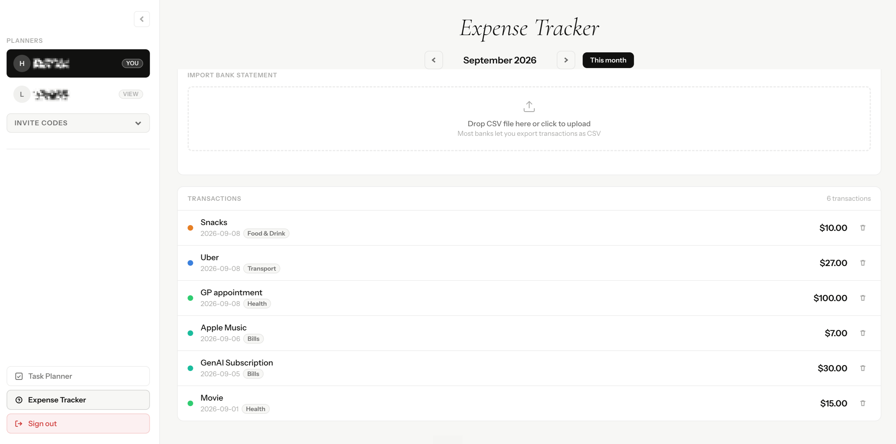
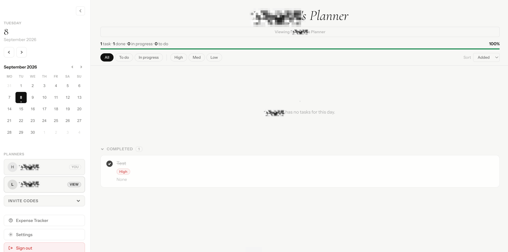
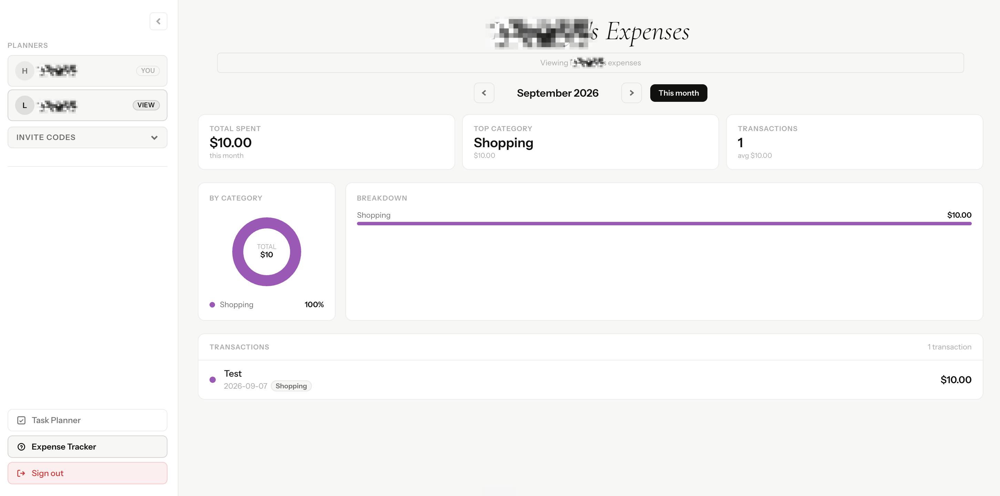

# Task Planner: a shareable daily planner and expense tracker

Task Planner is a small personal-productivity app in two parts that share one
account and one backend: a **daily planner** (`index.html`) for organising tasks
day by day, and an **expense tracker** (`expense.html`) for keeping an eye on
monthly spending. You sign in, plan your day, and can share a read-only view of
your planner or expenses with someone else using a short invite code.

> This is a free-time project, built out of plain curiosity more than anything
> else. I wanted my own planner, but I also wanted to understand how a real app
> fits together: accounts, a live database, data that syncs the moment you change
> it, and letting two people safely see the same thing. I had not used Firebase
> Auth or Firestore before, so I learned both from scratch here, including the
> part most tutorials skip, which is making the sharing actually secure rather
> than just appearing to work in the interface.

## What it does

**Planner (`index.html`)**

- Email and password accounts (Firebase Auth).
- A mini calendar; tasks are organised per day.
- Each task has a priority, an optional due time and a note; mark it done to
  strike it through.
- A progress bar and completed count for the day; sort by added order, priority
  or time; filter by status or priority.
- Settings for default priority, week start and showing completed tasks, an undo
  buffer, and a one-click export of the day's tasks to a text file.

**Expense tracker (`expense.html`)**

- Total spent this month and your top spending category at a glance.
- A by-category breakdown of where the money went.
- Add an expense with an amount and category, and recategorise later.

**Sharing (both apps)**

- Every account gets a short invite code.
- To let someone view your planner, you enter their code. They then see your
  planner, read-only, and you can revoke access at any time.
- Everything opens read-only for a viewer, so sharing never hands over control.

## Real-time and offline-feeling

Changes sync live through Firestore listeners, so a task or expense you add shows
up immediately, and a planner shared with you updates as its owner edits it. The
whole thing is two single HTML files with no build step.

## Using it

1. Open the app and create an account with your email, or sign in if you have one.
2. Pick a day on the calendar and add tasks with the "Add a task" box. Give each
   a priority, a due time or a note if you want, and tick it off when it's done.
   The progress bar tracks your day.
3. Open the Expense Tracker from the sidebar to log spending by category and see
   your monthly total and where the money is going.
4. To share your planner, open Invite Codes, enter the code of the person you
   want to give access to, and press Share. They then see your planner read-only.
   For them to share theirs back, they enter your code the same way.
5. Everything saves and syncs automatically, so you can sign in on any device and
   pick up where you left off.

## Security

Because this is a real multi-user app on a shared database, access control is the
interesting part, and all of it is enforced by Firestore security rules on the
server, never by the interface alone.

- Each person can read and write only their own data.
- Sharing works by the data **owner** granting a specific viewer access, recorded
  inside the owner's own space so the rules can trust it. Nobody can grant
  themselves access to someone else's data.
- A viewer can read only that owner's tasks and expenses, not their settings or
  the list of who else they share with.
- The invite-code directory is keyed by code, so a single code can be redeemed
  but the full list of users cannot be enumerated.
- No secrets are committed. The Firebase web config in the page is public by
  design, as it is in every Firebase web app; the real protection is the rules.
- reCAPTCHA App Check can be switched on as an optional extra layer.

The exact rules are in `firestore.rules`.

## Screenshots

<!--
To add these: create a folder named "screenshots" in this repo, drop your images
in with these names, and they will show up below. Or on GitHub, edit this file in
the browser and drag an image straight into the editor, then replace the path.
-->



| Expense tracker | Spending by category |
|---|---|
|  |  |

| Sharing controls | Viewing a shared planner |
|---|---|
|  |  |

## How it is built

| Piece | Detail |
|---|---|
| Frontend | Two single-file apps, vanilla HTML, CSS and JS, no framework or build step |
| Auth | Firebase Authentication (email and password) |
| Database | Cloud Firestore |
| Live updates | `onSnapshot` listeners re-render the moment data changes |
| Data model | `users/{uid}/tasks` and `users/{uid}/expenses`; `users/{uid}/viewers` holds owner-created access grants; a `directory` keyed by invite code maps a code to a user |
| Access control | Firestore security rules (`firestore.rules`) |
| Design | Editorial light theme (Cormorant Garamond and Instrument Sans), mobile-first |

## Run your own copy

1. Create a Firebase project, and enable **Authentication → Email/Password** and
   **Cloud Firestore**.
2. Replace the `firebase.initializeApp({...})` config near the top of the
   `<script>` in **both** `index.html` and `expense.html` with your own project's
   web config.
3. In Firestore, open the **Rules** tab and paste in the contents of
   `firestore.rules`, then Publish. This is what protects each user's data.
4. Serve the folder locally, or deploy it to any static host (Firebase Hosting,
   Vercel, Netlify, Cloudflare Pages):

   ```bash
   python -m http.server 8000   # then visit http://localhost:8000
   ```

## Files

```
taskplanner/
├── index.html        # the daily planner
├── expense.html      # the expense tracker (same account and backend)
├── firestore.rules   # the security rules that enforce access
├── screenshots/      # images shown in this README
└── (icons)           # favicon and app icons
```
